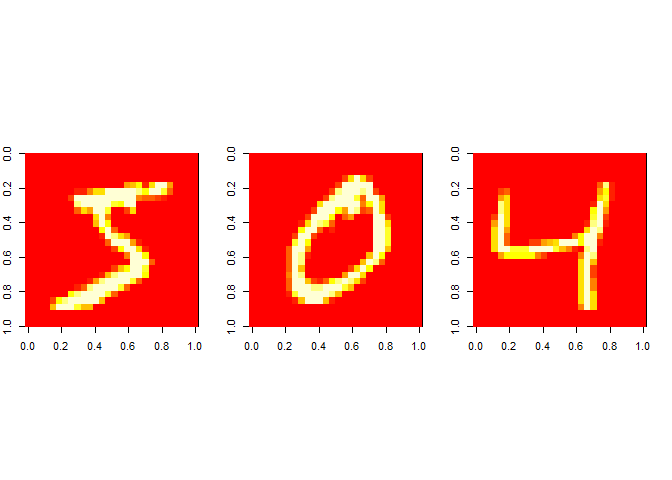
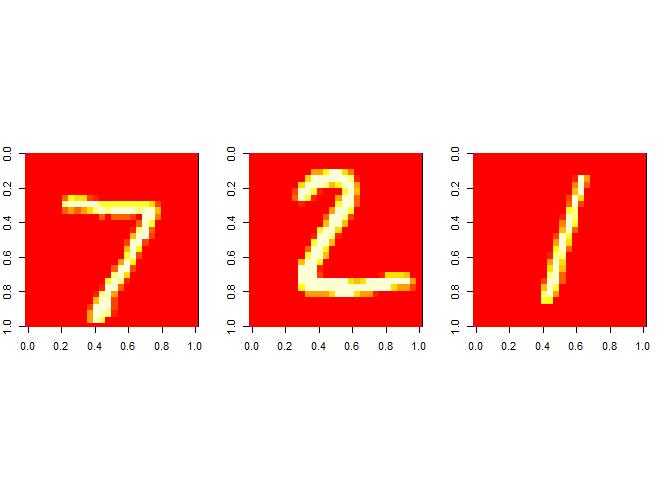
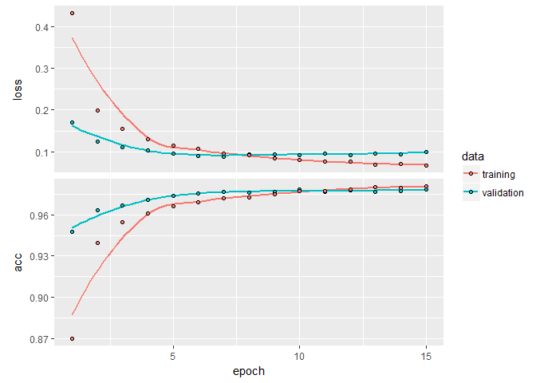

# TensorFlow with Keras Interface

MNIST Example: recognizing handwritten digits from the MNIST dataset. Each digit is a 28 x 28 grayscale image. 


```r
library(keras)
library(ggplot2)
library(imager)
library(flip)

packageVersion('keras')
```

```
## [1] '2.0.8'
```

## 1. Loading the Data


```r
# get MNIST dataset
mnist <- dataset_mnist()
x_train <- mnist$train$x
y_train <- mnist$train$y
x_test <- mnist$test$x
y_test <- mnist$test$y

str(x_train)
```

```
##  int [1:60000, 1:28, 1:28] 0 0 0 0 0 0 0 0 0 0 ...
```

```r
str(y_train)
```

```
##  int [1:60000(1d)] 5 0 4 1 9 2 1 3 1 4 ...
```

```r
str(x_test)
```

```
##  int [1:10000, 1:28, 1:28] 0 0 0 0 0 0 0 0 0 0 ...
```

```r
str(y_test)
```

```
##  int [1:10000(1d)] 7 2 1 0 4 1 4 9 5 9 ...
```

```r
# input image dimensions
img_rows <- 28
img_cols <- 28
print(paste(nrow(x_train), " train samples"))
```

```
## [1] "60000  train samples"
```

```r
print(paste(nrow(x_test), " test samples"))
```

```
## [1] "10000  test samples"
```

```r
print(paste('Image size:', img_rows, '*', img_cols))
```

```
## [1] "Image size: 28 * 28"
```

## 2. Displaying the Training Data in Images


```r
# display a few training images
par(mfrow = c(1, 3), pty = 's', mar = c(0, 2, 0, 2))
for (i in c(1, 2, 3)){
  m = matrix(unlist(x_train[i,,]), nrow = img_rows, byrow = TRUE)
  image(m, ylim=c(1, 0))
}
```

<!-- -->

```r
# display a few test images
par(mfrow=c(1,3),pty='s',mar=c(0,2,0,2))
for (i in c(1,2,3)){
  m = matrix(unlist(x_test[i,,]), nrow = img_rows, byrow = TRUE)
  image(m, ylim=c(1, 0))
}
```

<!-- -->

## 3. Preparing the Data


```r
input_shape = img_rows * img_cols

# convert the 3-d arrays into matrices. 28x28 images are flattened into length 784 vectors.
dim(x_train) <- c(nrow(x_train), input_shape)
dim(x_test) <- c(nrow(x_test), input_shape)

# convert the grayscale values from integers ranging between 0 to 255 into floating point values ranging between 0 and 1.
x_train <- x_train / 255
x_test <- x_test / 255
```


```r
# one-hot encode the y integer vectors into binary class matrices
num_classes = 10
y_train <- to_categorical(y_train, num_classes)
y_test <- to_categorical(y_test, num_classes)
```

## 4. Defining the Model


```r
# creating a sequential model and then adding layers
model <- keras_model_sequential() 
model %>% 
  layer_dense(units = 256, activation = "relu", input_shape = c(784)) %>% 
  layer_dropout(rate = 0.4) %>% 
  layer_dense(units = 128, activation = "relu") %>%
  layer_dropout(rate = 0.3) %>%
  layer_dense(units = 10, activation = "softmax")
```

## 5. Displaying the Details of the Model


```r
summary(model)
```

```
## ___________________________________________________________________________
## Layer (type)                     Output Shape                  Param #     
## ===========================================================================
## dense_1 (Dense)                  (None, 256)                   200960      
## ___________________________________________________________________________
## dropout_1 (Dropout)              (None, 256)                   0           
## ___________________________________________________________________________
## dense_2 (Dense)                  (None, 128)                   32896       
## ___________________________________________________________________________
## dropout_2 (Dropout)              (None, 128)                   0           
## ___________________________________________________________________________
## dense_3 (Dense)                  (None, 10)                    1290        
## ===========================================================================
## Total params: 235,146
## Trainable params: 235,146
## Non-trainable params: 0
## ___________________________________________________________________________
```

## 6. Compiling the Model 


```r
# compile the model with appropriate loss function, optimizer, and metrics
model %>% compile(loss = "categorical_crossentropy", optimizer = optimizer_rmsprop(), metrics = c("accuracy"))
```

## 7. Training the Model


```r
# Use the fit() function to train the model with callback for TensorBoard
epochs <- 15
tbCallBack = callback_tensorboard("logs")
history <- model %>% fit(x_train, y_train, epochs = epochs, batch_size = 128, validation_split = 0.2, callbacks = tbCallBack)
```

## 8. Display the Training Detail


```r
print(history$params$metrics)
```

```
## [1] "loss"     "acc"      "val_loss" "val_acc"
```

```r
plot(history)
```

<!-- -->

## 9 Evaluating the Model


```r
# Evaluate the model's performance on the test data:
model %>% evaluate(x_test, y_test,verbose = 0)
```

```
## $loss
## [1] 0.08386142
## 
## $acc
## [1] 0.9792
```

## 10 Generate Predictions with the Test Data


```r
# Generate predictions on test data:
classes <- model %>% predict_classes(x_test)
head(classes)
```

```
## [1] 7 2 1 0 4 1
```

```r
tail(classes)
```

```
## [1] 1 2 3 4 5 6
```
